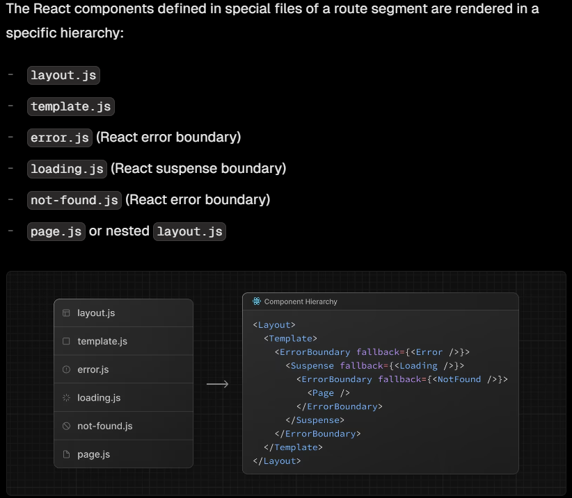

- If an error is thrown within the error boundary, the error is contained, and the fallback component is rendered.

- When the fallback error component is active, layouts above the error boundary maintain their state and remain interactive, and the error component can display functionality to recover from the error.

- An error.js boundary will not handle errors thrown in a layout.js component in the same segment because the error boundary is nested inside that layout's component.
